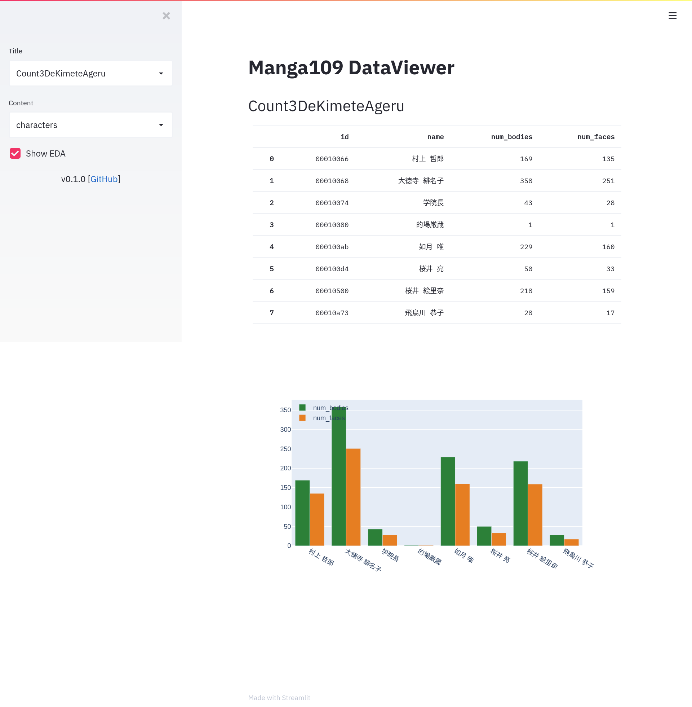

# manga109-dataviewer

This library is a rich data viewer for [Manga109](http://www.manga109.org).

## Demo

### Characters View



### Pages View


## Get Started

```bash
git clone https://github.com/skmatz/manga109-dataviewer
cd manga109-dataviewer
make link path=path/to/the/manga109
```

Prepare Japanese font and set [config.yml](./config.yml).

### Docker

```bash
PORT=8888 docker-compose up -d
```

### Local

```bash
# If you don't have Poetry yet, install it as follows.
curl -Ls https://raw.githubusercontent.com/python-poetry/poetry/master/get-poetry.py | python

make install
make run port=8888
```
